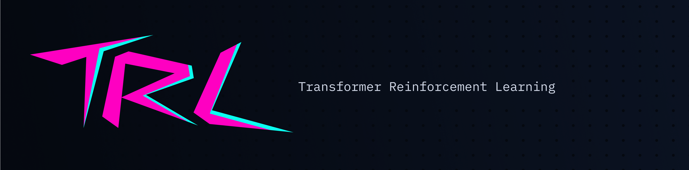

# TRL - Transformer Reinforcement Learning



# 🌌 Custom TRL: Elegance and Power in Reinforcement Learning

Welcome to a project where fundamental mathematics meets cutting-edge artificial intelligence. This library is not just a custom analogue of the popular Hugging Face solution; it is a deeply reimagined, elegant, and crystal-clear architecture for fine-tuning Large Language Models (LLMs) using the **PPO (Proximal Policy Optimization)** algorithm.

We believe that the process of creating AI should be as beautiful as the result of its work. This repository was forged for researchers and engineers who refuse to settle for "black boxes" and strive for absolute control over every tensor, every optimization step, and every nuance of the neural network alignment process (RLHF).

Unlock the true potential of your models, guiding their generation with surgical precision and observing the process through the lens of flawless analytics.

---

## ✨ The Art of Technology: Key Features

* **Architectural Purity and Freedom:** A completely open and intuitive PPO pipeline. You gain unlimited power over calculating KL divergence, estimating advantages, and shaping the surrogate loss function. No hidden abstractions—just the pure logic of the algorithm.
* **A Symphony of Metrics with Weights & Biases (W&B):** Watch your model train in real-time. Our native and deep integration with W&B transforms dry numbers into mesmerizing convergence graphs and interactive `game_log` tables, where every generated token and earned reward unfolds right before your eyes.
* **Generation Without Borders:** Built-in and perfected sampling mechanisms (Top-K and Nucleus) allow your models to balance on the fine line between absolute creativity and strict logical coherence.

---

## 🚀 Magic in One Click: Launch in Google Colab

We understand that time is a researcher's most valuable resource. You don't need to spend hours setting up a local environment, hunting for available GPUs, and resolving dependencies. 

We have prepared an interactive Jupyter Notebook for you, where you can touch the training process directly in your browser. Launch a full RLHF cycle, experiment with hyperparameters, and watch your model evolve in real-time.

[](https://colab.research.google.com/drive/1VvLGbyk4pvS1M1lIumQ3Awr-OjPfUUmj?usp=sharing)

> *Simply click the badge above, make a copy of the notebook to your Google Drive, and let the magic of training begin.*

---

## 📦 Elegant Installation

If you prefer to work in your own laboratory, deploying the project takes only a few moments. Clone the repository and install the dependencies:

```bash
!pip install "git+https://github.com/TimaGitHub/trl.git"
```

---

## 📊 Visualizing Triumph: W&B Integration

Reinforcement learning for neural networks is a complex dance between policy and value. Our library makes this dance visible. 

By activating the `use_wandb=True` flag, your dashboard transforms into a true mission control center:
1. **The Aesthetics of Graphs:** Watch as the average reward (`reward_mean`) smoothly rises and how the system elegantly keeps KL divergence within set boundaries, preventing the model from losing its grip on reality.
2. **Interactive Chronicles (Game Log):** Each epoch leaves a mark in the form of a beautiful table. Read the input prompts, evaluate the generated texts, and analyze the rewards. These are not just logs—they are the coming-of-age story of your AI.

Create, experiment, and inspire!